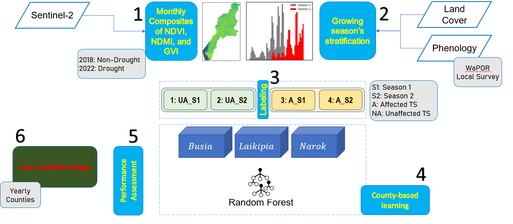

# Crop Condition

Monthly Vegetation indexes from Sentinel-2 images are used as input to classify regions affected by drought.
Thie repository includes two codes:
- crop_condition_model
- model_implementation

The idea is following the below workflow:

 
